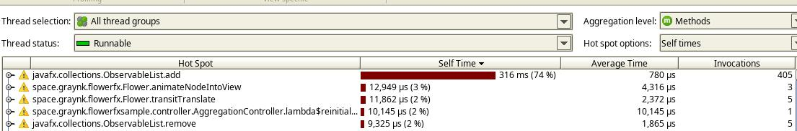

# FlowerFX
A small library to manage animated switching between panes in JavaFX. I made it for usage in an embedded environment, since DataFX
was performing pretty poorly and afterburner.fx is documented only with videos and seemed too restrictive. 

## Dependencies
* Annotations from JetBrains

## Usage
Implied structure of your application is like this:

There's a main scene (main FXML) with Pane of some sort where other Panes are being inserted to.
Accordingly, the main controller for this scene handles signalling the library which Panes have to be loaded.
 
In the `start()` method of your application create a Flower object and pass to the constructor
the stage, FXML of the main controller and FXML of the first desired scene.  

`Flower<Menu> flower = new Flower<>(primaryStage, Main.class.getResource("view/menu/menu.fxml"),
                 Main.class.getResource("view/menu/main.fxml"), Flower.AnimatedTransition.SWIPE);`

The main controller (`Menu` in this case) must implement the interface `Flowable`, which basically means that there have 
to be methods that look somewhat like this (note that `addPane` and `removePrevPane` have default implementations) and 
can be omitted:

     @Override
     public Pane getPane() {
         return mainPane;
     }
 
     @Override
     public void addPane(Node node) {
         mainPane.getChildren().add(node);
     }
 
     @Override
     public void removePrevPane(Node node) {
         mainPane.getChildren().remove(node);
     }
 
     @Override
     public void setSwapper(Swapper swapper) {
         this.swapper = swapper;
     }
Other controllers must implement the interface `Swappable`, which is just `setSwapper(Swapper swapper)` and `reinitialize()` 
that gets called _every_ time a node enters the scene (as opposed to `initialize()` that's called once). `reinitialize()`
is needed to reset the node to it's neutral state if needed.

Then, in the event handlers for your buttons in the scene (or somewhere else where you want) call the swapper to change 
the scene to the next:
`swapper.changeView(AnalysisMenu.class.getResource("journal/journal.fxml"), true)`
or to the previous one:
`swapper.fuckGoBack()`. When switching, you should pass `boolean reinitialize` parameter to specify where you want to restore 
the node to it's original state (you also have to implement this in the Swappable :^) ). 
You can also go back to specific scene, using `swapper.backToSpecific("menu.fxml")`

To pass the data between the scenes you can use `addToContext(String key, Object value)`, 
`getFromContext(String key)` and `removeContext(String key)` methods of the swapper.
To get current name of the scene or primary stage use `getCurrentSceneName()` and `getPrimaryStage()`.

You can preload heavy scenes at the start of the app using `flower.preload(list)`. That won't help much tho.
 
 Supported animations:
 * SWIPE
 * FADE
 * NONE
 
 Sample project is included. To run use:
 
     ./gradlew build
     cd flowerfx-sample
     ./gradlew run

## Known problems
Even with preloading, first render (first adding to the scene) takes a lot of time. A lot. This happens inside 
of JavaFX itself and there's not much I can do about it. It has to happen on FX thread as well: I can't add an object to 
visible scene on background thread, this will throw an exception. As a result there's stuttering on every first load of a 
node (to the point of missing the animation part entirely). After that the caching kicks in and switching becomes 
relatively smooth (which is the point of it all).

According to JProfiler, the heaviest method is `javafx.collections.ObservableList.add`. I don't know any way to pre-render 
nodes offscreen either.

